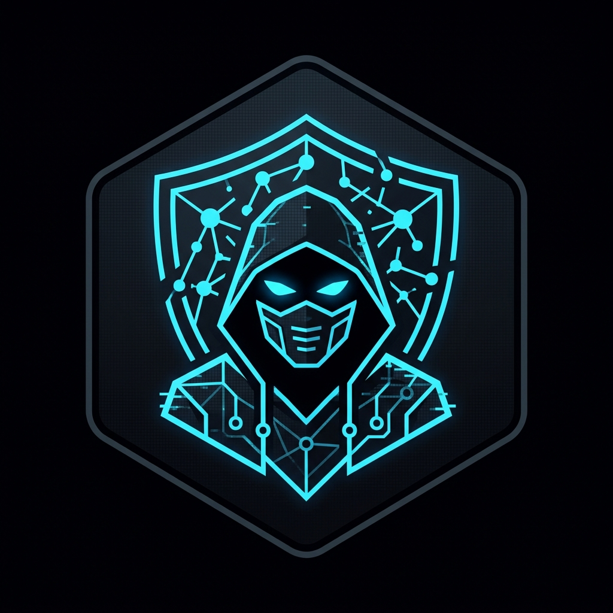
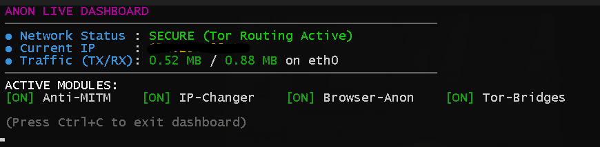
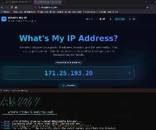
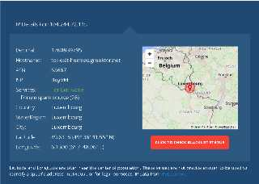

<div align="center">
  
  <h1>Anon - Nihai Gizlilik ve Anonimlik Çerçevesi</h1>
  <p><b>Etik hackerlar, araştırmacılar ve gizlilik savunucuları için tasarlanmış gelişmiş, hepsi bir arada operasyonel güvenlik (OPSEC) aracı.</b></p>
  
  <p>
    <a href="https://github.com/egnake/anon/releases"></a>
    
    
    
    
  </p>
  <p><i><a href="README.md">English documentation available here</a></i></p>
</div>

---

<div align="center">
  
</div>

<div align="center">
  
  <br><i>Tor yönlendirme durumunun ve ağ trafiğinin gerçek zamanlı izlenmesi.</i>
</div>

<div align="center">
  
  <br><i>Sıfır İz (Zero-Trace), RAM tabanlı İzole Tarayıcı (Tor ağı üzerinden bağlanmış).</i>
</div>

<div align="center">
  
  <br><i>Garantili OPSEC: Tor ağı üzerinden sistem geneli şeffaf proxy yönlendirmesi.</i>
</div>

---

## 📖 İçindekiler
- [Genel Bakış](#-genel-bakış)
- [Temel Özellikler ve Modüller](#-temel-özellikler-ve-modüller)
- [Gelişmiş OPSEC Sıkılaştırması](#-gelişmiş-opsec-sıkılaştırması)
- [Gereksinimler](#-gereksinimler)
- [Kurulum](#-kurulum)
  - [Kali Linux / Debian / Ubuntu](#kali-linux--debian--ubuntu)
  - [Windows (WSL 2 üzerinden)](#windows-wsl-2-üzerinden)
- [Kullanım](#-kullanım)
- [Arka Planda Neler Oluyor?](#-arka-planda-neler-oluyor)
- [Sıkça Sorulan Sorular (SSS)](#-sıkça-sorulan-sorular-sss)
- [Yasal Uyarı](#-yasal-uyarı)
- [Lisans](#-lisans)

---

## 📌 Genel Bakış

Günümüz dijital dünyasında, gerçek bir operasyonel güvenlik için sadece VPN kullanmak genellikle yetersiz kalır. **Anon**, sisteminizin tüm ağ trafiğini katı `iptables` kuralları kullanarak zorla **Tor ağı** üzerinden geçiren güçlü bir Bash tabanlı araçtır. 

Anon sadece ağ yönlendirmesi yapmakla kalmaz; donanım kimliklerini (MAC adresleri) rastgele hale getirerek, donanım takibini (Bluetooth) engelleyerek, geçici bellek verilerini silerek (Anti Cold Boot), işletim sistemi parmak izlerini manipüle ederek ve Ortadaki Adam (MITM) saldırılarını engelleyerek makinenizin izini aktif olarak gizler ve sisteminizi sıkılaştırır.

---

## ✨ Temel Özellikler ve Modüller

Anon tamamen modülerdir. Aşağıdaki güvenlik katmanlarının herhangi bir kombinasyonunu aktif edebilirsiniz:

1. **🌐 Anti-MITM (Ortadaki Adam Saldırısı Koruması)** 
   Yerel ağınızdaki ARP zehirlenmesi (spoofing) ve zararlı paket enjeksiyonu saldırılarını tespit eder ve engeller.
2. **🧹 Log Killer (Kayıt Yokedici)** 
   `secure-delete` (`srm`) kullanarak sistem kayıtlarını (`/var/log/*`) üstüne yazarak tamamen yok eder, diskte etkinliklerinize dair hiçbir iz kalmamasını sağlar.
3. **🎭 IP Changer (Şeffaf Proxy)** 
   Tor dışındaki tüm trafiği engellemek için `iptables` kurallarını ayarlar. Tüm TCP/UDP bağlantılarını Tor'un şeffaf proxy'sine yönlendirerek gerçek IP adresinizi gizler.
4. **📡 DNS Changer** 
   `/etc/resolv.conf` dosyasını değiştirerek ve DNS sorgularını Tor'un izole edilmiş DNS portuna (Port 5300) zorlayarak DNS sızıntılarını engeller.
5. **📱 MAC Changer** 
   Ağ kartlarınızın fiziksel MAC adreslerini rastgele hale getirerek yerel ağlarda (örn. halka açık Wi-Fi) cihazınızın takip edilmesini önler.
6. **🏷️ Hostname Changer** 
   Makinenizin bilgisayar adını geçici olarak rastgele bir metinle değiştirir.
7. **🕵️ Browser Anonymization (Tarayıcı Anonimleştirme)** 
   Canvas parmak izi okumayı (fingerprinting) ve WebRTC IP sızıntılarını önlemek için desteklenen tarayıcılara anti-fingerprint yapılandırmaları enjekte eder.
8. **❄️ Anti Cold Boot** 
   Cold Boot (fiziksel bellek) saldırılarına karşı sistem kapatıldığında kalan RAM içeriğini (`sdmem`) güvenli bir şekilde siler.
9. **🛑 Kill Switch** 
    Acil bir durumda, makinenizin internetle bağlantısını anında kesmek için tüm ağ trafiğini engelleyen kurallar uygular.

---

## 🛡️ Gelişmiş OPSEC Sıkılaştırması

Bu modüller, Anon'u basit bir proxy yönlendiriciden çok daha öteye, derin paket incelemelerine ve gelişmiş takip sistemlerine karşı koymak için tasarlanmış bir OPSEC aracına dönüştürür:

10. **🌉 Tor Bridges (Obfs4 Köprüleri)**
    Obfs4 modülünü kullanarak Tor trafiğinizi tamamen anlamsız rastgele verilere dönüştürür ve Tor sansürünü (Örn: Çin veya kurumsal ağlar) atlatmanızı sağlar.
    > **Not:** Sansürlenen bir bölgede yaşıyorsanız köprüleri KULLANMAK ZORUNDASINIZ. Köprü edinmek için [bridges.torproject.org/options](https://bridges.torproject.org/options) adresini ziyaret edip **obfs4**'ü seçin. (IPv6 yerine IPv4 seçtiğinizden emin olun) ve verilen satırları menü istendiğinde yapıştırın.
11. **💻 OS Obfuscation (İşletim Sistemi Gizleme)**
    Kernel düzeyindeki `sysctl` ağ parametrelerini değiştirerek Nmap gibi tarayıcıların Linux bilgisayarınızı sıradan bir "Windows 10" cihazı olarak algılamasını sağlar.
12. **📴 Bluetooth Disabler (Sinyal Takip Koruması)**
    Tüm Bluetooth donanımlarını `rfkill` ile bloke ederek cihazınızın pasif sinyaller aracılığıyla takip edilmesini engeller.
13. **👻 Process Obfuscation (Süreç Gizleme)**
    `nmap`, `sqlmap`, `tor` gibi göze batan araçların işlem isimlerini değiştirir. Sistemde sanki sıradan bir arka plan işlemiymiş (örn. `[kworker/u4:2]`) gibi görünürler.
14. **⛓️ Proxychains-ng Entegrasyonu**
    `proxychains4.conf` dosyasını otomatik olarak yapılandırıp Tor'un Socks5 bağlantı noktasına (9050) bağlar. Proxy ayarlarını umursamayan inatçı araçları güvenli bir şekilde Tor ağından çıkmaya zorlar.
15. **⏳ Fake Timezone Synchronization (Sahte Saat Dilimi)**
    Sistemi rastgele bir global saat dilimine (Örn: `Asia/Tokyo`, `America/New_York`) ayarlayarak saat/zaman bazlı parmak izi saldırılarını bozar.

---

## 📦 Gereksinimler

Anon interaktif bir **Bağımlılık Kontrolörü** barındırır. Aracı başlattığınızda gerekli paketler eksikse, bunları sizin için otomatik olarak `apt-get` ile kurmayı teklif eder. Başlıca paketler şunlardır:
- `tor`, `obfs4proxy`, `proxychains4`
- `iptables`, `macchanger`, `network-manager`, `rfkill`
- `secure-delete`, `python3-scapy`, `curl`

---

## 🚀 Kurulum

### Kali Linux / Debian / Ubuntu
```bash
# Repoyu kopyalayın
git clone https://github.com/egnake/anon.git
cd anon

# Bağımlılıkları ve global kısayolu yükleyin
sudo make install

# Aracı çalıştırın
sudo anon
```

### Windows (WSL 2 üzerinden)
Anon, Windows Subsystem for Linux (WSL) mimarisini sorunsuzca destekler.
1. **WSL 2**'nin yüklü olduğundan emin olun.
2. `setup.bat` dosyasını standart bir kullanıcı olarak çalıştırın. (Gerekli yolları ayarlayıp derlemeyi tamamlayacaktır).
3. Yeni bir Komut İstemi açın ve şunu yazın:
```cmd
anon
```

---

## 🎮 Kullanım

### İnteraktif Menü
`anon` yazarak interaktif menüyü açın. Açmak istediğiniz modülün numarasını yazıp Enter'a basın. Modül açıldığında yeşil renkli `[ ✔ ON ]` işareti belirir. Hazır olduğunuzda `0` tuşuna basıp onaylayın, sistem kendini mühürleyip Tor ağına bağlanacaktır.
```bash
sudo anon
```

### Hızlı Komutlar
İnteraktif menüyü atlayıp doğrudan işlem yapmak için:
```bash
# Anon'u en son kaydedilen yapılandırmalarınızla hemen başlatın
sudo anon --start

# Tüm özellikleri durdurup orijinal ağ ayarlarınıza geri dönün
sudo anon --stop

# Aktif modüllerin durumunu görün
sudo anon --status

# Canlı (Live) Gösterge Paneli'ni açın
sudo anon --dashboard

# Sıfır İz (Zero-Trace) bırakmayan tamamen RAM-tabanlı gizli tarayıcı başlatın
sudo anon --browser

# Yardım menüsünü gösterir
anon --help
```

---

## 🔧 Arka Planda Neler Oluyor?
**IP Changer** modülünü açtığınızda Anon sadece yerel bir proxy ayarlamakla kalmaz. Aktif olarak mevcut `iptables` kurallarınızı siler ve bir **Tor Şeffaf Proxy (Transparent Proxy)** kurar. DNS isteklerini Tor'un DNS noktasına, tüm TCP trafiğini de Tor'un TransPort noktasına zorlar. Tor ağını bypass edip dışarı sızmaya çalışan tüm trafikler anında **DÜŞÜRÜLÜR (DROP)**, bu da tek bir baytın bile sızmasını kesin olarak engeller.

---

## ❓ Sıkça Sorulan Sorular (SSS)

**S: Trafik Tor ağından geçiyorsa, kullandığım Çıkış Düğümünün (Exit Node) IP adresi tersine mühendislik ile takip edilip bana ulaşılamaz mı?**

**C:** Klasik bir VPN kullansaydınız sizi saniyeler içinde bulabilirlerdi, fakat **Tor mimarisinde bu (özellikle devlet/istihbarat düzeyinde bile) matematiksel ve fiziksel olarak pratikte imkansızdır.** Çünkü Tor 3 katmanlı bir "Soğan" (Onion) mimarisi kullanır:
1. **Giriş Düğümü (Örn: obfs4 Köprülerimiz):** Sizin kim olduğunuzu bilir (Türkiye IP'si), ama nereye gittiğinizi, hangi veriyi taşıdığınızı asla bilemez. Veriniz dışarıdan bir şifre katmanıyla sarılıdır. Obfs4 sayesinde ayrıca internet servis sağlayıcınız bile bu trafiğin Tor olduğunu anlamaz.
2. **Orta Düğüm (Middle Relay):** Sadece Giriş'ten gelip Çıkış'a giden şifreli trafiğin kuryesidir. Ne gerçek IP'nizi, ne de bağlandığınız hedef siteyi bilir. Kör bir noktadır.
3. **Çıkış Düğümü (Örn: Lüksemburg/İsveç IP'si):** Şifreyi çözer ve hedef siteye (Örn: facebook.com) bağlanır. Sizin hangi siteye bağlandığınızı bilir, ancak verinin Orta Düğüm'den geldiğini görür. Sizin Türkiye'deki **gerçek IP adresinizi veya kimliğinizi asla bilemez!**

Bir kurumun Tor trafiğinizi geriye doğru çözebilmesi (Trafik Zamanlama Analizi) için, eş zamanlı olarak hem bağlandığınız Giriş Düğümüne (Köprünüze) hem de Çıkış Düğümüne küresel ölçekte hakim olması gerekir. Sistemimizdeki `anon --browser` modülü ise arkanızda tarayıcı parmak izi bırakmadığı (her açılışta RAM'den silindiği) için, kimlik tespiti ataklarını tamamen işe yaramaz hale getirir.

**S: Peki Giriş Düğümü (Entry Guard) benim gerçek IP adresimi biliyor! Yetkililer Giriş Düğümünü ele geçirip beni bulamaz mı?**

**C:** Hayır, bulamazlar. Çünkü Tor mimarisinde **bilgi parçalanmıştır** ve hiçbir düğüm yapbozun tamamına sahip değildir.
Eğer yetkililer Giriş Düğümünü ele geçirirse, kayıtlarda sadece şunu görürler: *"X IP'si bana bağlandı ve ben ondan gelen şifreli veriyi Y Orta Düğümüne ilettim."* Senin **KİM** olduğunu bulurlar ama **NE YAPTIĞINI** (hangi siteye girdiğini, ne indirdiğini) asla bilemezler çünkü paket şifrelidir.
Eğer Çıkış Düğümünü ele geçirirlerse, kayıtlarda şunu görürler: *"Y Orta Düğümünden gelen biri şu hedef siteye bağlandı."* Bu sefer de **NE YAPILDIĞINI** bulurlar ama **KİMİN YAPTIĞINI** asla bilemezler.
- **Giriş Düğümü:** KİM olduğunu bilir, NE yaptığını bilmez.
- **Çıkış Düğümü:** NE yapıldığını bilir, KİM olduğunu bilmez.
- **Orta Düğüm:** İkisini de bilmez! Sadece iki düğüm arasında kör bir kuryedir.

Bu kusursuz kriptografik ayrım sayesinde, giriş düğümündeki gerçek IP'niz ile çıkış düğümündeki aktiviteleriniz birbirine matematiksel olarak asla bağlanamaz.

---

## ⚠️ Yasal Uyarı
**Anon yalnızca eğitim, araştırma ve etik siber güvenlik amaçlı olarak geliştirilmiştir.** 
Geliştiriciler bu aracın hiçbir yasadışı aktivitede kullanımını onaylamaz veya desteklemez. Aracı kullanırken her türlü yerel veya uluslararası yasaya uymak kullanıcının kendi sorumluluğundadır.

---

## 📄 Lisans
Bu proje [MIT Lisansı](LICENSE) ile lisanslanmıştır.
